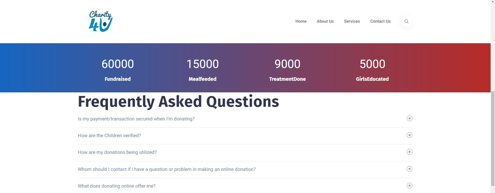

# [Charity4u](https://charity4u.netlify.app/) ⭐

&nbsp;
&nbsp;
&nbsp;
&nbsp;<br/>


[](https://charity4u.netlify.app/)
[](https://github.com/ROHAN842/Charity4u)

## Overview 👀




- Charity donation campaign 💸 to promote girl 👧 child education
- Feed them with proper meal 🍔 and give treatment in hospital 🏥 if there is a need 
- FAQ ❓sectiion and contact ☎ section to resolve donor's queries
- Clean UI ⚡

## What is Charity4u? 🤔

#### Charity4u is a donation website where users can donate amount using razorpay payment gateway integration through "Donate here" button.
#### The donation will be reflected in girl child education, feeding them with proper meal and doing proper treatment by donating funds in hospital’s. 


## How it works? 🤔
- **Open the website [https://charity4u.netlify.app/](https://charity4u.netlify.app/)**
- **Donor just needs to click on "Donate here" button in home page, after that user may continue further by entering all their account details as well as the amount number which they want to donate.**
- **Donor can also read the FAQ section present in the website, if after that also donor's doubt is not cleared then they may fill the contact form present on the ContactUs page of the website with all necessary details asked in the form.**


## Dependencies 🗃

- [Bootstrap](https://getbootstrap.com/docs/3.3/getting-started/) - **Frontend Framework**
- [Razorpay API](https://razorpay.com/) - **Server Side Payment Gateway Integration**

## Run Locally 💻

```
> Clone the repo
    >> For Windows: Git Bash
    >> For Linux: Terminal
    >> git clone https://github.com/ROHAN842/Charity4u.git
    >> cd Charity4u
> Install all dependencies
    >> npm i
> Spin the live server on port 127.0.0.1

> Visit the website on http://127.0.0.1:5500/
    
```
